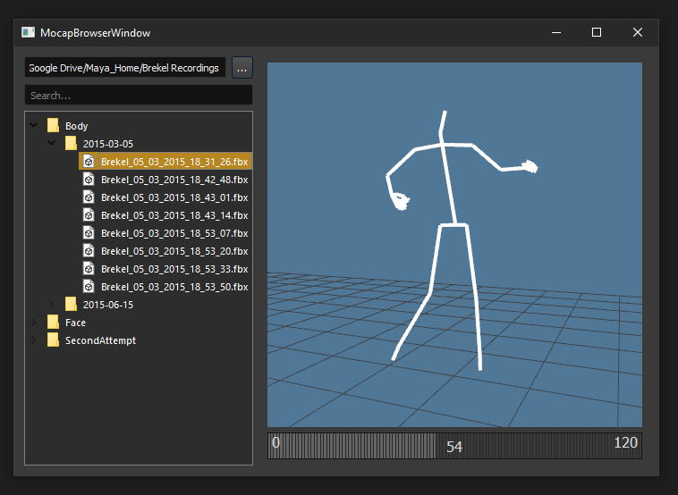

# mocap-finder
WIP standalone fbx viewer tool

# Requires
PyOpenGL, Python FBX SDK

# Install

<pre>
1. Download this package and unzip it in a good location 
    1.B (or git clone it directly if you have git installed)
2. Run installer.bat (will walk you through some options for install)
3. Restart the DCC
</pre>

# Start the tool
1. Run this script in a python tab in maya

<pre>

import mocap_finder
mocap_finder.main()

</pre>

