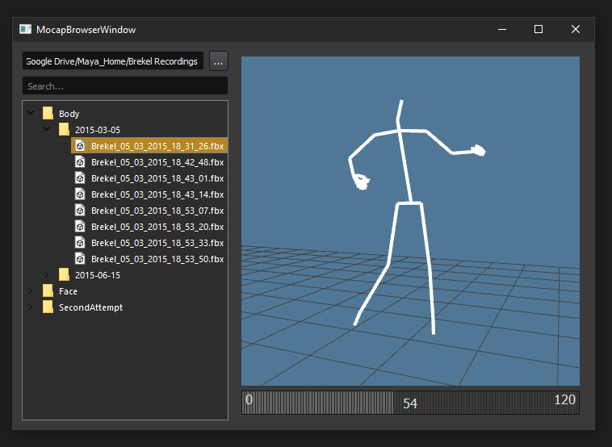

# mocap-browser
WIP standalone fbx viewer tool

# Requires
PyOpenGL, Python FBX SDK, numpy

numpy is only needed for the skinned mesh preview - without it the viewport falls back to
drawing skeletons on their own.

# Previewing a skinned mesh
Bones on their own are hard to read, so the viewport can drape a character over whichever
clip is loaded. Pick one through **Display > Set preview mesh...**, or right click a file
in the tree and choose **Use as preview mesh**. The mesh is matched to the clip by bone
name, so any skinned FBX built on the same skeleton works, and the choice is remembered
between sessions. Clips that carry their own meshes draw those instead.

# Install

<pre>
1. Download this package and unzip it in a good location 
    1.B (or git clone it directly if you have git installed)
2. Run installer.bat (will walk you through some options for install)
3. Restart the DCC
</pre>

# Start the tool
1. Run this script in a python tab in maya

<pre>

import mocap_browser
mocap_browser.main()

</pre>

